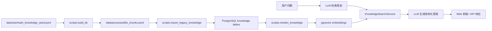

# MathRAG

MathRAG 是一个面向数学问答场景的 RAG 原型系统，基于 **FastAPI + PostgreSQL/pgvector + OpenAI-Compatible Embedding API + DeepSeek/OpenAI-Compatible Chat API** 构建。

系统会先从本地结构化数学知识库中检索相关知识，再让大模型生成结构化回答，并通过浏览器前端展示答案、步骤、参考知识、检索规划和可继续追问的问题。

---

## 功能概览

- **数学 RAG 问答**：`/api/chat` 提供检索增强问答。
- **Agentic 检索规划**：先由 LLM 将用户问题改写为 1~4 条检索子问题，再合并检索结果。
- **pgvector 向量检索**：PostgreSQL 是在线知识的唯一事实数据源，按状态、可见性和模型精确过滤。
- **结构化知识库**：JSONL 种子知识经过可重复导入与 reindex 进入 PostgreSQL/pgvector。
- **知识抽取**：支持从文本、公开网页源、本地 PDF 抽取并追加知识点。
- **公式渲染**：前端通过 KaTeX 渲染 `\(...\)` 与 `\[...\]` 公式。
- **LLM JSON 修复**：对模型输出中常见 LaTeX 反斜杠转义问题做容错修复。
- **Docker 部署**：提供 `Dockerfile` 与 `docker-compose.yml`。
- **测试覆盖**：提供 API、RAG、导入器相关 pytest 用例。

---

## 项目结构

```text
MathRAG/
├── app/
│   ├── api/                  # FastAPI 路由：chat / knowledge
│   ├── core/                 # 配置、日志
│   ├── frontend/             # 原生 HTML/CSS/JS 前端，含 KaTeX 渲染
│   ├── schemas/              # Pydantic 请求/响应模型
│   ├── modules/knowledge/    # pgvector 模型、仓储、检索与 reindex 服务
│   ├── services/             # LLM、RAG、导入器
│   └── utils/                # Prompt 构建、文本清洗、数学后处理
├── data/
│   ├── raw/                  # 原始知识库 JSONL
│   ├── processed/            # 预处理后的 chunk JSONL
│   └── index/                # 仅供历史 evaluation/回滚审计的冻结工件
├── scripts/                  # 构建、导入、验证、调试脚本
├── tests/                    # pytest 测试
├── Dockerfile
├── docker-compose.yml
├── requirements.txt          # 生产依赖，不包含 FAISS
├── requirements-evaluation.txt
├── run.py
└── README.md
```

核心数据流：



---

## 环境要求

推荐环境：

- Python 3.11+
- PostgreSQL 及 pgvector 扩展
- 可用的 OpenAI-Compatible Embedding API
- 可用的 DeepSeek 或 OpenAI-Compatible Chat API
- 如需 Docker 部署：Docker / Docker Compose

安装依赖：

```bash
python -m venv .venv
```

Windows PowerShell：

```powershell
.\.venv\Scripts\Activate.ps1
pip install -r requirements.lock.txt
```

Linux / macOS：

```bash
source .venv/bin/activate
pip install -r requirements.lock.txt
```

---

## 配置 `.env`

可以从示例文件复制：

```bash
cp .env.example .env
```

Windows PowerShell：

```powershell
Copy-Item .env.example .env
```

示例配置：

```env
# App
APP_NAME=MathRAG MVP
APP_HOST=127.0.0.1
APP_PORT=8000
DEBUG=true

# Embedding，要求兼容 OpenAI embeddings 接口
EMBEDDING_API_KEY=sk-xxxx
EMBEDDING_BASE_URL=https://dashscope.aliyuncs.com/compatible-mode/v1
EMBEDDING_MODEL=text-embedding-v4
EMBEDDING_DIMENSIONS=1024
EMBEDDING_BATCH_SIZE=10
EMBEDDING_TIMEOUT=60
EMBEDDING_NORMALIZE=true

# LLM，要求兼容 OpenAI chat.completions 接口
LLM_API_KEY=sk-xxxx
LLM_BASE_URL=https://api.deepseek.com
LLM_MODEL=deepseek-reasoner
LLM_TIMEOUT=600
LLM_MAX_TOKENS=2048
LLM_TEMPERATURE=0.2
LLM_RETURN_REASONING=false

# Retrieval
TOP_K=3
```

说明：

- `EMBEDDING_DIMENSIONS` 固定为 `1024`，必须与数据库列及实际 embedding 模型一致。
- 在线检索只读取 PostgreSQL/pgvector，不读取 `data/index` 下的历史工件。
- `/api/chat` 响应模型保留 `reasoning_content` 字段，当前通常返回 `null`。

---

## 快速启动

先启动数据库、执行迁移，并按下文导入和 reindex 知识数据：

```bash
docker compose up -d postgres
alembic upgrade head
python -m scripts.import_legacy_knowledge
python -m scripts.reindex_knowledge
```

然后启动应用：

```bash
python run.py
```

或使用开发模式：

```bash
uvicorn app.main:app --host 127.0.0.1 --port 8000 --reload
```

访问：

- 首页：<http://127.0.0.1:8000/>
- Swagger：<http://127.0.0.1:8000/docs>
- 健康检查：<http://127.0.0.1:8000/health>

---

## 知识库格式

原始知识库文件：

```text
data/raw/math_knowledge_seed.jsonl
```

每一行是一个 JSON 对象，字段顺序固定为：

```text
id, category, title, keywords, content, example, steps, difficulty
```

示例：

```json
{"id":"k0001","category":"quadratic_equation","title":"因式分解法解一元二次方程","keywords":["一元二次方程","因式分解"],"content":"当方程可以写成 \\(ab=0\\) 的形式时，可令每个因式分别为 0 来求解。","example":"解方程 \\(x^2+4x+3=0\\)。","steps":["把方程因式分解为 \\((x+1)(x+3)=0\\)。","分别令 \\(x+1=0\\)、\\(x+3=0\\)。","得到 \\(x=-1\\) 或 \\(x=-3\\)。"],"difficulty":"easy"}
```

字段说明：

| 字段 | 类型 | 说明 |
|---|---|---|
| `id` | string | 知识点 ID，格式如 `k0001` |
| `category` | string | 分类，建议使用中文或 snake_case |
| `title` | string | 知识点标题 |
| `keywords` | string[] | 关键词，不能为空 |
| `content` | string | 核心知识内容，不能为空 |
| `example` | string | 示例，可为空字符串 |
| `steps` | string[] | 理解或解题步骤，不能为空 |
| `difficulty` | string | `easy` / `medium` / `hard` |

当前新版 schema **不再使用** `stage`、`course`、`prerequisites`。

公式规范：

- 行内公式：`\(...\)`
- 块级公式：`\[...\]`
- 不建议继续新增 `$...$` 或 `$$...$$`

---

## 导入知识库并构建 pgvector 向量

### 1. 校验种子知识库

```bash
python -m scripts.validate_seed_jsonl
```

指定输入和错误输出：

```bash
python -m scripts.validate_seed_jsonl \
  --input data/raw/math_knowledge_seed.jsonl \
  --error-output data/raw/seed_validate_errors.jsonl
```

### 2. 构建 chunk

```bash
python -m scripts.build_kb
```

自定义路径：

```bash
python -m scripts.build_kb \
  --input data/raw/math_knowledge_seed.jsonl \
  --output data/processed/kb_chunks.jsonl
```

生成字段包括：

- `chunk_id`
- `source_id`
- `category`
- `title`
- `keywords`
- `content`
- `example`
- `steps`
- `difficulty`
- `source_line`
- `retrieval_text`
- `answer_context`
- `metadata`

### 3. 执行数据库迁移

```bash
alembic upgrade head
```

### 4. 幂等导入历史知识

```bash
python -m scripts.import_legacy_knowledge
```

该命令读取 raw seed 与 processed chunk，写入 PostgreSQL；重复执行会按已有状态跳过，不维护第二套在线索引。

### 5. 生成或刷新 pgvector 向量

```bash
python -m scripts.reindex_knowledge
```

reindex 会批量调用 Embedding Provider，并把当前模型下成功的 chunk 更新为 `ready`。重复执行时只处理仍需更新的记录。

---

## 知识导入

### 从文本片段抽取知识点 API

接口：`POST /api/knowledge/extract`

请求示例：

```json
{
  "text": "一元二次方程 x^2+4x+3=0 可以分解为 (x+1)(x+3)=0。",
  "category": "quadratic_equation",
  "save": true
}
```

响应会返回抽取出的 `records`。当 `save=true` 时，记录会追加到：

```text
data/raw/math_knowledge_seed.jsonl
```

追加后需要重新执行：

```bash
python -m scripts.validate_seed_jsonl
python -m scripts.build_kb
python -m scripts.import_legacy_knowledge
python -m scripts.reindex_knowledge
```

### 从公开数学站点导入

```bash
python -m scripts.import_math_knowledge \
  --sources wikipedia wikibooks \
  --keywords derivative \
  --limit-per-source 2 \
  --category calculus
```

常用参数：

| 参数 | 说明 |
|---|---|
| `--sources` | 数据源，可选 `proofwiki`、`planetmath`、`wikibooks`、`wikipedia` |
| `--keywords` | 搜索关键词，可传多个 |
| `--limit-per-source` | 每个数据源、每个关键词最多取多少条结果，默认 `3` |
| `--output` | 输出 JSONL，默认 `data/raw/math_knowledge_seed.jsonl` |
| `--error-output` | 错误输出 JSONL，默认 `data/raw/math_knowledge_import_errors.jsonl` |
| `--category` | 分类提示 |
| `--max-chunk-chars` | 每个 LLM chunk 最大字符数，默认 `6000` |
| `--delay-seconds` | 页面请求间隔，默认 `1.0` 秒 |

### 从本地 PDF 导入

把 PDF 放入：

```text
data/data_lake/
```

仅抽取清洗后的文本 chunk：

```bash
python -m scripts.import_pdf_knowledge \
  --data-dir data/data_lake \
  --text-output data/processed/pdf_text_chunks.jsonl \
  --max-chunk-chars 3000
```

抽取文本并调用 LLM 结构化写入知识库：

```bash
python -m scripts.import_pdf_knowledge \
  --data-dir data/data_lake \
  --max-chunks 20 \
  --max-chunk-chars 3000 \
  --import-to-knowledge \
  --category "高中数学"
```

常用参数：

| 参数 | 说明 |
|---|---|
| `--data-dir` | PDF 目录，默认 `data/data_lake` |
| `--text-output` | 清洗后的 PDF 文本 chunk JSONL |
| `--output` | 使用 `--import-to-knowledge` 时写入的种子知识库 |
| `--error-output` | PDF 导入错误输出 |
| `--no-recursive` | 不递归扫描子目录 |
| `--append-text-output` | 追加写入文本 chunk，不覆盖 |
| `--max-chunk-chars` | 每个文本 chunk 最大字符数，默认 `4000` |
| `--max-chunks` | 最多处理多少个 chunk，适合小批量试跑 |
| `--import-to-knowledge` | 启用 LLM 结构化导入 |
| `--category` | 分类提示 |

---

## 公式与 LaTeX 处理

项目统一推荐使用 KaTeX 分隔符：

- 行内：`\(...\)`
- 块级：`\[...\]`

如果旧数据中有 `$...$` 或 `$$...$$`，可以先 dry-run：

```bash
python -m scripts.normalize_latex_delimiters
```

确认后写回并自动备份：

```bash
python -m scripts.normalize_latex_delimiters --write
```

指定输入/输出：

```bash
python -m scripts.normalize_latex_delimiters \
  --input data/raw/math_knowledge_seed.jsonl \
  --output data/raw/math_knowledge_seed.normalized.jsonl \
  --write
```

如果 chunk 元数据、数量、顺序或 `retrieval_text` 发生变化，应重新构建 processed 输入、幂等导入并 reindex：

```bash
python -m scripts.build_kb
python -m scripts.import_legacy_knowledge
python -m scripts.reindex_knowledge
```

---

## 调试脚本

### 仅测试检索

```bash
python -m scripts.demo_query --question "x^2+4x+3=0 怎么解？" --show-context
```

交互模式：

```bash
python -m scripts.demo_query --interactive --show-context
```

### 测试完整 RAG 链路

```bash
python -m scripts.test_rag \
  --question "x^2+4x+3=0 怎么解？" \
  --show-references
```

打印完整 JSON：

```bash
python -m scripts.test_rag \
  --question "x^2+4x+3=0 怎么解？" \
  --show-full-json
```

### 离线 FAISS/pgvector 对账

生产依赖与 Docker 镜像不安装 FAISS。只有需要复核冻结历史工件时才安装 evaluation 依赖：

```bash
pip install -r requirements-evaluation.lock.txt
python -m scripts.evaluate_pgvector_retrieval \
  --fixture tests/fixtures/retrieval_questions.json \
  --output docs/baselines/artifacts/pgvector-faiss-m3-2026-07-30.json \
  --replace-existing
```

evaluation 使用同一批 query vectors 对账只读 legacy FAISS 与 pgvector；不得把历史 FAISS 工件重新接回在线请求路径。

### 回滚

发布前保留数据库备份、上一版本容器镜像和冻结的 `data/index` 工件。发生检索回归时按以下顺序执行：

1. 先按入口网关/负载均衡平台的 runbook 停止新流量，并暂停知识写入入口。
2. 停止当前应用，数据库保持运行：

```bash
docker compose stop mathrag
```

3. 优先部署上一版本镜像：

```bash
export MATHRAG_ROLLBACK_IMAGE="<上一版本镜像>"
docker pull "${MATHRAG_ROLLBACK_IMAGE}"
docker image tag "${MATHRAG_ROLLBACK_IMAGE}" mathrag:local
docker compose up -d --no-build mathrag
```

没有可用镜像时，可从 M2 固定基点构建；最终 baseline 会记录验收时的精确回滚 SHA：

```bash
git switch --detach cd77635
docker build --pull=false -t mathrag:local .
docker compose up -d --no-build mathrag
```

4. 冻结的旧 FAISS 工件只读使用，禁止重建或覆盖：

```bash
chmod a-w data/index/faiss.index data/index/id_map.json
```

5. 使用回滚环境变量验证存活和就绪状态，不在文档中固化真实地址：

```bash
export MATHRAG_BASE_URL="<回滚环境地址>"
curl -fsS "${MATHRAG_BASE_URL}/health/live"
curl -fsS "${MATHRAG_BASE_URL}/health/ready"
```

两个 health 检查都成功后才恢复入口流量和知识写入。禁止同一在线版本长期并行 FAISS 与 pgvector 两条检索路径；数据迁移需要回滚时按 Alembic 版本和数据库备份单独执行，不修改冻结的 evaluation 工件。

---

## API 示例

### 健康检查

```http
GET /health
```

响应：

```json
{
  "status": "ok",
  "app_name": "MathRAG MVP"
}
```

### 数学问答

```http
POST /api/chat
Content-Type: application/json
```

请求：

```json
{
  "question": "x^2+4x+3=0 怎么解？",
  "history": [
    {"role": "user", "content": "我想复习一元二次方程。"},
    {"role": "assistant", "content": "可以从因式分解法、配方法和求根公式开始。"}
  ],
  "top_k": 3
}
```

响应结构示例：

```json
{
  "question": "x^2+4x+3=0 怎么解？",
  "answer": "可以因式分解为 \\((x+1)(x+3)=0\\)，所以 \\(x=-1\\) 或 \\(x=-3\\)。",
  "steps": [
    "把方程写成标准形式 \\(x^2+4x+3=0\\)。",
    "分解为 \\((x+1)(x+3)=0\\)。",
    "分别令两个因式为 0，得到 \\(x=-1\\) 或 \\(x=-3\\)。"
  ],
  "used_knowledge": ["因式分解法解一元二次方程"],
  "related_questions": [
    "什么时候适合使用因式分解法？",
    "同一道题如何用求根公式求解？"
  ],
  "references": [
    {
      "rank": 1,
      "score": 0.91,
      "index": 12,
      "chunk_id": "k0001_chunk_0",
      "source_id": "k0001",
      "category": "quadratic_equation",
      "title": "因式分解法解一元二次方程",
      "keywords": ["一元二次方程", "因式分解"],
      "content": "...",
      "example": "...",
      "steps": ["..."],
      "difficulty": "easy",
      "answer_context": "...",
      "retrieval_text": "...",
      "source_line": 1,
      "metadata": {}
    }
  ],
  "agentic_plan": {
    "strategy": "围绕一元二次方程因式分解和求根步骤进行检索。",
    "retrieval_queries": ["一元二次方程 因式分解 解法", "x^2+4x+3=0 求根"]
  },
  "reasoning_content": null
}
```

### 知识抽取

```http
POST /api/knowledge/extract
Content-Type: application/json
```

请求：

```json
{
  "text": "函数 y=kx+b 且 k 不等于 0 时称为一次函数。",
  "category": "函数",
  "save": false
}
```

响应：

```json
{
  "records": [
    {
      "id": "k0001",
      "category": "函数",
      "title": "一次函数的概念",
      "keywords": ["一次函数", "函数"],
      "content": "形如 \\(y=kx+b\\) 且 \\(k\\ne0\\) 的函数称为一次函数。",
      "example": "例如 \\(y=2x+3\\) 是一次函数。",
      "steps": ["识别表达式是否为 \\(y=kx+b\\)。", "检查 \\(k\\ne0\\)。"],
      "difficulty": "easy"
    }
  ],
  "saved_count": 0,
  "knowledge_path": "data/raw/math_knowledge_seed.jsonl",
  "next_steps": []
}
```

---

## 前端说明

前端文件位于：

```text
app/frontend/index.html
app/frontend/style.css
app/frontend/app.js
```

能力：

- 输入数学问题并调用 `/api/chat`
- 展示 answer / steps / references / related_questions
- 展示 agentic 检索规划
- 使用 KaTeX 自动渲染公式

注意：当前 KaTeX 通过 jsDelivr CDN 引入。如果部署环境不能访问外网，可改为本地托管 KaTeX 静态资源。

---

## Docker 部署

### 本地数据库开发

```powershell
Copy-Item .env.example .env
docker compose up -d postgres
.\.venv\Scripts\alembic.exe upgrade head
.\.venv\Scripts\python.exe run.py
```

健康检查：

```powershell
Invoke-RestMethod http://127.0.0.1:8000/health/live
Invoke-RestMethod http://127.0.0.1:8000/health/ready
```

`/health/live` 只检查应用进程；`/health/ready` 同时检查数据库、关键配置和 pgvector 扩展。

### 完整 Compose 启动

`docker-compose.yml` 会从当前工作区构建 `mathrag:local`，并启动固定版本的 PostgreSQL/pgvector。首次创建数据库卷时，先执行迁移，再启动应用：

```powershell
Copy-Item .env.example .env
docker compose up -d postgres
.\.venv\Scripts\alembic.exe upgrade head
docker compose up -d --build mathrag
docker compose ps
```

查看日志：

```bash
docker compose logs -f mathrag postgres
```

服务只绑定本机回环地址：

```text
127.0.0.1:8000 -> container:8000
127.0.0.1:5432 -> container:5432
```

停止服务：

```bash
docker compose down
```

---

## 测试

仅安装 `requirements.lock.txt` 的纯 runtime 环境不收集 FAISS evaluation 用例：

```bash
pytest -q --ignore=tests/evaluation --ignore=tests/test_retrieval_baseline.py
```

运行完整测试前安装包含 FAISS 的 evaluation 锁：

```bash
pip install -r requirements-evaluation.lock.txt
pytest -q
```

测试主要覆盖：

- `/api/chat` 响应结构与异常处理
- `/api/knowledge/extract` 保存/预览逻辑
- RAG 多查询规划与 Knowledge Search 批量检索
- PostgreSQL/pgvector 导入、reindex、检索与运行时依赖边界
- 数学知识导入器
- PDF 知识导入器

---

## 常见问题

### `ModuleNotFoundError: No module named 'app'`

请在项目根目录运行命令，并优先使用模块方式：

```bash
python -m scripts.build_kb
python -m scripts.import_legacy_knowledge
python -m scripts.reindex_knowledge
```

### `ModuleNotFoundError: No module named 'dotenv'`

说明当前 Python 环境没有安装项目依赖。先激活虚拟环境并安装依赖：

```bash
pip install -r requirements.lock.txt
```

### `LLM_API_KEY` 或 `EMBEDDING_API_KEY` 缺失

检查 `.env` 是否存在，并确认 key 名称正确：

```env
LLM_API_KEY=...
EMBEDDING_API_KEY=...
```

### pgvector 检索没有返回知识

先确认数据库迁移已到最新版本，再幂等导入并 reindex：

```bash
alembic upgrade head
python -m scripts.import_legacy_knowledge
python -m scripts.reindex_knowledge
```

同时确认当前 Embedding 模型、固定 1024 维契约和数据库中 chunk 的 `ready` 状态一致。

### 公式没有渲染

检查：

1. 前端是否能加载 KaTeX CDN。
2. 公式是否使用 `\(...\)` 或 `\[...\]`。
3. JSON 字符串里的反斜杠是否正确转义。

---

## 开发约定

- 新知识库记录只使用新版字段：`id/category/title/keywords/content/example/steps/difficulty`。
- 新增公式统一使用 KaTeX LaTeX 分隔符。
- 修改 `math_knowledge_seed.jsonl` 后，应依次执行校验、构建 chunk、幂等导入和 reindex。
- 在线代码只依赖 PostgreSQL/pgvector；FAISS 仅允许出现在 evaluation 依赖和离线对账脚本中。
- 临时 PDF、依赖、备份文件已通过 `.gitignore` / `.dockerignore` 排除。

---

## License

本项目主要用于教学、演示与研究原型。
