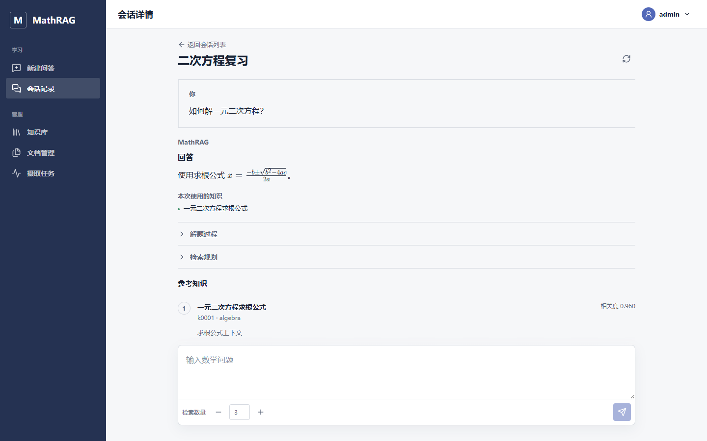
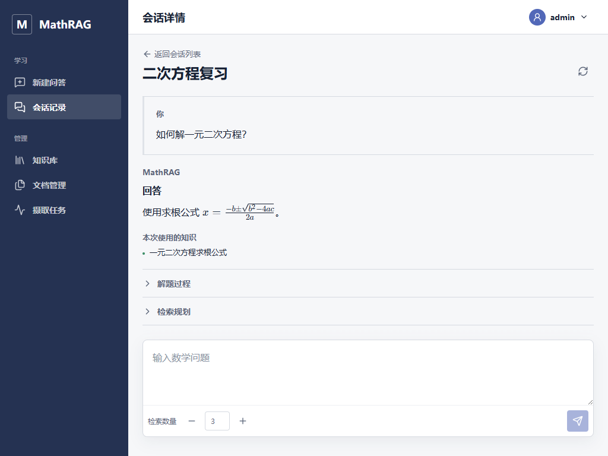
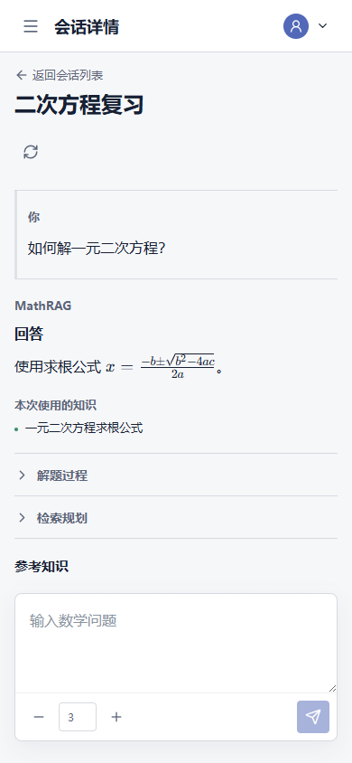

# MathRAG M6 Vue 前端验收基线

## 1. 验收结论

M6 已完成 Vue 3 + TypeScript 单页应用切换，交付登录、持久化问答、会话管理、知识管理、文档上传与摄取任务管理界面。FastAPI 同源托管生产构建产物，旧原生前端和旧 `/api/chat` 已删除；未知 API 保持 JSON 404，不会被 SPA fallback 吞掉。

验收时间：2026-07-31（Asia/Shanghai）。

## 2. 版本与构建

| 项目 | 值 |
|---|---|
| M6 基点 / M5 main | `fce45f6` |
| M6 任务 1-12 最后提交 | `dca4021` |
| 最终验收与文档 | 本文所在提交 |
| 开发分支 | `codex/m6-vue-frontend` |
| Python / Node.js | `3.11.9` / `24.11.1` |
| Vue / TypeScript / Vite | `3.5.40` / `5.9.3` / `8.2.0` |
| 最终镜像 | `mathrag:m6` |
| 镜像 ID | `sha256:a27248893c2e00f047099a44b97f9e99b7e8be664742da9aaef00d02f972bba7` |

镜像使用 Node 构建阶段生成 `frontend/dist`，Python runtime 只复制构建产物，不包含 `frontend/node_modules`。Gunicorn 固定启动一个 Uvicorn worker。

## 3. 质量门禁

| 分层 | 结果 |
|---|---:|
| OpenAPI 导出与 TypeScript 类型漂移 | 通过，无差异 |
| Prettier / ESLint / vue-tsc | 全部通过 |
| Vitest | 14 files，87 passed |
| Vite production build | 1899 modules transformed |
| Playwright E2E | 9 passed |
| 三视口遮挡回归 | 3 passed |
| backend runtime | 576 passed，1 warning |
| production Chromium smoke | 1 passed |
| Docker production build | 通过 |

backend runtime 使用独立 `mathrag_test` 数据库，命令固定排除只在 evaluation 依赖中提供 FAISS 的测试：

```text
pytest -q -rs --ignore=tests/evaluation --ignore=tests/test_retrieval_baseline.py
576 passed, 1 warning in 114.67s
```

唯一 warning 是既有 Starlette TestClient 弃用提示。CI 分为 frontend、backend、container 三个 job；backend job 显式创建 `mathrag_test`，不再让 `DATABASE_URL` 与 `TEST_DATABASE_URL` 指向同一数据库。

## 4. 生产镜像冒烟

最终镜像连接 Compose PostgreSQL/pgvector，在 `127.0.0.1:8010` 临时启动并通过以下检查：

| 检查 | 结果 |
|---|---:|
| `/health/live` | 200 JSON |
| `/health/ready` | 200，database=ok，pgvector=0.8.5 |
| `/login` 与嵌套会话路由直接刷新 | 200 HTML |
| 未知 `/api/v1/not-found` | 404 JSON |
| 已删除 `POST /api/chat` | 404 JSON |
| 真实 Chromium 登录 | 200，生产 `__Host-` Cookie 生效 |
| 缺失 CSRF 创建会话 | 403 |
| 有效 CSRF 创建会话 | 201 |
| `me` / knowledge / documents / jobs 读取 | 200 |
| 已认证 RAG 空载荷 | 422，停在契约层 |

冒烟使用唯一临时管理员，完成后已删除用户并由外键级联清理其 Session 和 Conversation。RAG 新建、继续、取消、幂等重试，以及知识 CRUD、上传、任务取消/重试由 backend runtime 和确定性 E2E 覆盖；生产冒烟不调用真实外部 LLM 或 Embedding 服务。

## 5. 视觉验收

三个视口均使用真实 Chromium 和确定性 API 响应截图。已检查页面横向溢出、中文文本、KaTeX 像素输出、导航、控件边界和 composer 遮挡。

### 桌面 1440x900



### 平板 1024x768



### 移动端 390x844



视觉检查发现并修复了会话页 sticky composer 覆盖参考知识的问题。当前会话页使用“页头 / 独立滚动消息区 / composer”三段布局；最后一个参考条目必须位于 composer 之前的断言已纳入三视口 E2E。

## 6. 交付契约

- 9 条前端路由可直接进入和刷新，管理员路由由角色守卫保护。
- 所有功能请求经统一 API client 发送，Session 与 CSRF 不写入浏览器持久存储。
- 模型文本先作为纯文本进入 DOM，再由本地 KaTeX 渲染；不使用 `v-html`。
- OpenAPI 可重复导出，生成的 `schema.d.ts` 由 CI 检查漂移。
- 知识编辑保留 revision 冲突草稿；上传和任务页面只消费公开 DTO。
- SPA fallback 只处理允许 HTML 的无扩展前端路径，API、health、docs、OpenAPI 和缺失静态文件保留后端语义。

## 7. 已知限制与 M7 移交

M6 摄取仍使用单进程 FastAPI `BackgroundTasks`，因此部署固定为单 worker。进程退出后的任务恢复、并发租约、分布式调度和容量控制尚未实现。

M7 需要处理：

1. Redis/Celery 或等价持久任务队列，以及 worker 租约、重试和恢复。
2. 多 worker 并发安全、全局限流、反向代理、公网 TLS 和可观测性。
3. OCR、复杂 PDF 版面理解、文件病毒扫描和大文件容量测试。
4. RAG run 历史读取、旧消息引用补录，以及可选的流式回答。

验收结束后停止临时生产容器和 Compose 服务，执行 `docker compose down` 而不删除数据卷，并确认 `docker compose ps --all` 为空。
