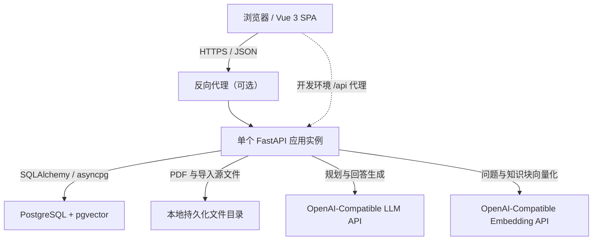
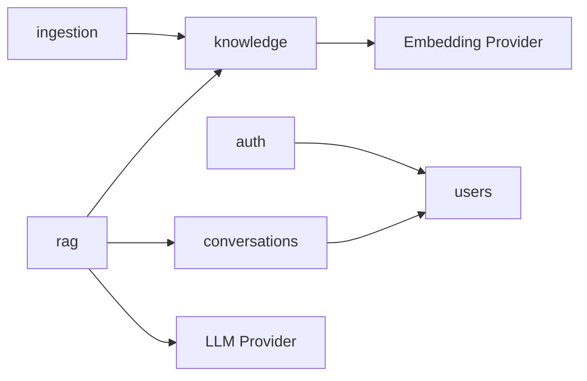
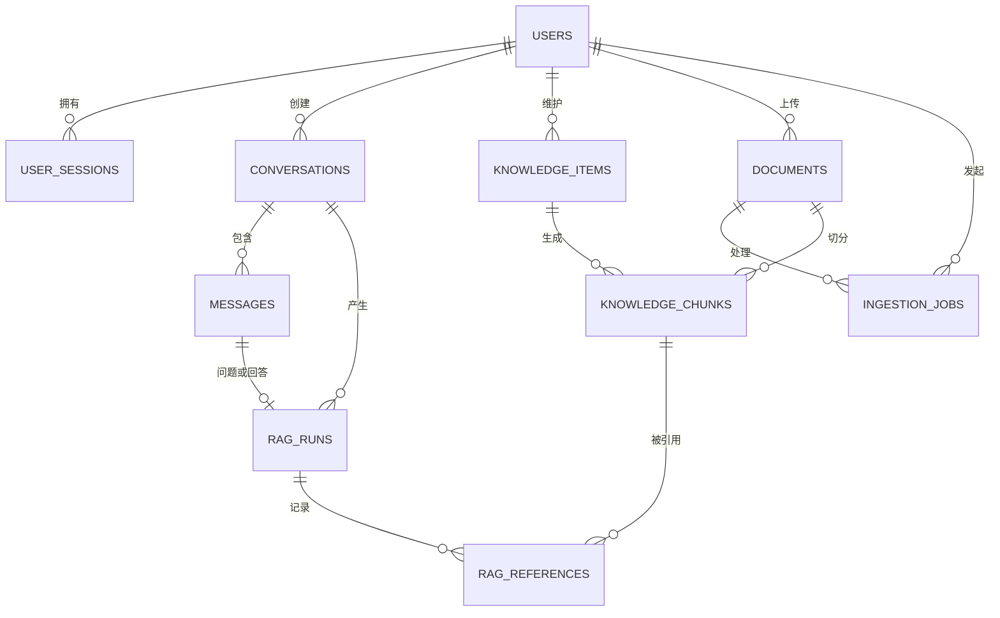
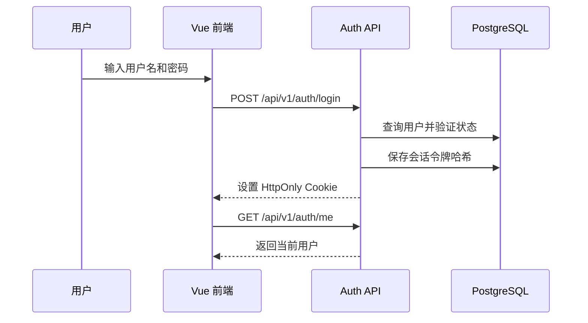
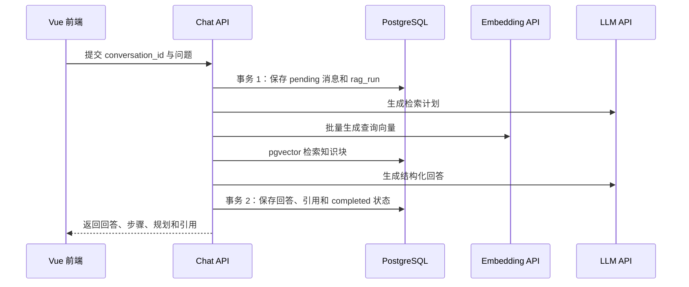
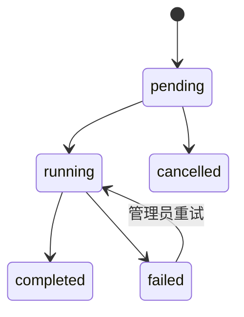
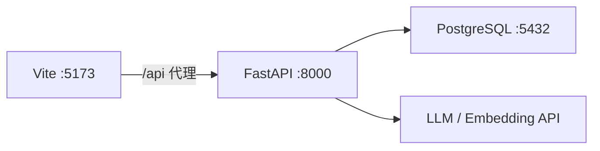
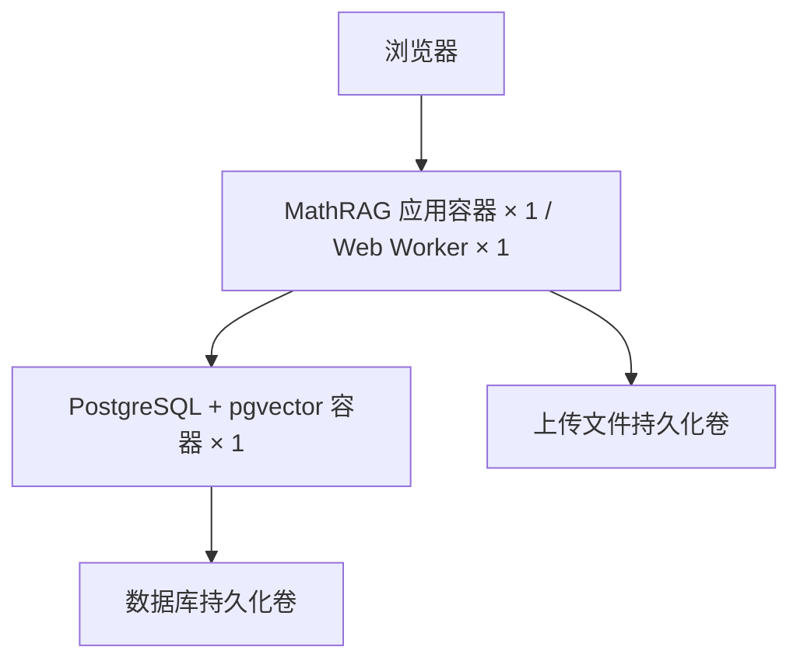

# MathRAG 项目总体架构设计

## 1. 文档信息

- 文档状态：设计草案，供项目负责人评审
- 编写日期：2026-07-29
- 适用项目：MathRAG
- 目标版本：从当前原型演进到可支持多用户并发的单实例应用
- 前端技术栈：Vue 3 + TypeScript + Vite + Composition API
- 后端技术栈：模块化单体 FastAPI + PostgreSQL + SQLAlchemy + Alembic + pgvector
- 初始部署形态：单个应用实例（一个异步 Web Worker）+ 单个 PostgreSQL 实例

## 2. 执行摘要

MathRAG 将采用前后端分离开发、同源生产部署的模块化单体架构。

前端使用 Vue 3、TypeScript、Vite 和 Composition API，负责用户认证、数学问答、会话管理、知识库管理、文档导入和任务状态展示。生产构建产物由 FastAPI 或位于其前方的反向代理提供。

后端继续使用 FastAPI，但从目前按技术类型划分的 `api/services/schemas` 结构，逐步调整为按业务能力划分的模块化单体。用户、会话、知识库、文档导入和 RAG 分别形成边界清晰的业务模块，仍然作为一个应用部署，不拆分微服务。

PostgreSQL 是唯一事实数据源。SQLAlchemy 负责数据库模型、查询、事务和连接池；Alembic 负责数据库结构迁移；pgvector 负责保存知识块向量并执行相似度检索。当前 JSONL、FAISS 和 `id_map.json` 降级为迁移输入、离线导出或回滚备份，不再参与在线双写。

第一阶段采用单个 FastAPI 应用实例。应用内部不得保存影响正确性的可变业务状态，从而为后续增加多个应用实例保留扩展空间。Redis、Celery、Qdrant 和微服务均不属于第一阶段范围。

## 3. 当前状态与主要问题

当前项目已经具备以下基础：

- FastAPI API 入口、Pydantic 请求响应模型和 Swagger/OpenAPI 文档。
- 数学问答、Agentic 检索规划、Embedding、FAISS 检索和 LLM 结构化回答。
- 文本、网页和 PDF 知识导入脚本。
- 原生 HTML、CSS、JavaScript 前端及 KaTeX 公式渲染。
- pytest API 和服务测试。
- Dockerfile 与 Docker Compose 部署文件。

当前数据链路为：

```text
math_knowledge_seed.jsonl
  -> build_kb
  -> kb_chunks.jsonl
  -> build_index
  -> faiss.index + id_map.json
```

这一实现适合单用户原型，但不适合作为多用户在线系统的持久化基础：

1. JSONL 并发追加无法提供数据库级事务、唯一性和并发控制。
2. 知识内容修改或删除需要重新生成派生文件和完整索引。
3. FAISS、`id_map` 和 chunk 文件可能处于不同版本。
4. 每个进程单独加载 Retriever，索引更新后不能自动保持一致。
5. 用户、会话、消息、权限和任务状态没有持久化模型。
6. API 路由直接调用全局服务函数，数据库事务和依赖替换边界不明确。
7. 前端状态、请求和 DOM 渲染集中在单个脚本中，缺少类型检查和组件测试。

## 4. 架构目标

### 4.1 功能目标

- 支持用户登录、退出和会话身份识别。
- 支持多个用户并发进行数学问答。
- 持久化会话、消息、RAG 运行记录和引用结果。
- 支持知识点、文档、知识块的增删改查。
- 支持 pgvector 相似度检索和结构化条件过滤。
- 支持知识导入过程的状态追踪和错误恢复。
- 支持前端管理知识库、查看导入状态和回顾历史会话。
- 保留现有数学公式渲染、检索规划和参考知识展示能力。

### 4.2 质量目标

- 数据库是唯一事实数据源，不在线双写 JSONL 和数据库。
- 路由、业务规则、持久化和外部服务调用职责分离。
- 不在 HTTP 请求期间长期持有数据库事务。
- 外部 LLM 和 Embedding 调用具备超时、重试上限和错误归类。
- 所有数据库结构变更通过 Alembic 管理。
- API 契约能够生成 TypeScript 类型。
- 核心业务逻辑能够脱离 HTTP 和真实外部 API 进行单元测试。
- 单实例阶段也遵循无状态应用原则，为水平扩展保留空间。

### 4.3 非目标

第一阶段不实现：

- 微服务拆分。
- Kubernetes 部署。
- Redis 分布式缓存。
- Celery、Dramatiq 等分布式任务队列。
- Qdrant、Milvus、Elasticsearch 等独立检索服务。
- 多租户计费系统。
- 多地域容灾。
- 实时多人协同编辑。

## 5. 设计假设

本设计采用以下明确假设：

- 系统运行在单机或单个内网服务器上，通过 Docker Compose 管理应用和数据库。
- 初期只有一个 FastAPI 应用容器和一个异步 Web Worker；异步 I/O 负责并发处理。只有在压测证明单 Worker 不足，并且进程内协调状态已经迁移到共享存储后，才增加 Worker 数。
- PostgreSQL 是独立容器，并使用持久化数据卷。
- 系统支持多个注册用户，角色至少包括 `admin` 和 `user`。
- 公共知识库由管理员维护，普通用户默认只读。
- 用户的会话与聊天消息相互隔离。
- PDF 和其他原始文件保存在受控的共享数据目录，数据库保存元数据和文件路径。
- 当前 Embedding 默认维度为 1024；更换模型或维度必须通过迁移流程重新生成向量。
- 大批量 PDF/网页导入继续通过管理命令执行；在线 API 仅执行有大小和数量上限的导入操作。

## 6. 方案比较与决策

### 6.1 方案 A：继续横向分层单体与文件存储

结构维持 `api/services/schemas`，知识库继续使用 JSONL 和 FAISS。

优点：

- 改动最小。
- 保留当前脚本和运行方式。
- 单用户演示成本低。

缺点：

- 无法可靠处理并发写入。
- 文件、索引和进程内状态容易失去一致性。
- 用户、会话和权限功能会继续堆积在公共 service 目录。
- 后续数据库迁移成本继续增加。

结论：不采用。

### 6.2 方案 B：模块化单体 + PostgreSQL + pgvector

按业务模块组织 FastAPI，PostgreSQL 同时保存业务数据和知识向量。

优点：

- 一个代码库和一个应用部署单元，运维成本可控。
- PostgreSQL 提供事务、约束、并发控制和备份能力。
- pgvector 消除在线系统对 FAISS 文件版本同步的依赖。
- 模块边界清晰，未来可按实际压力拆出独立服务。
- 适合当前团队规模和项目成熟度。

缺点：

- 需要一次性建立数据库模型、迁移和仓储层。
- 需要验证 pgvector 检索结果与现有 FAISS 的差异。
- 需要重构当前同步服务和全局单例。

结论：采用。

### 6.3 方案 C：立即拆分微服务

将用户、知识库、RAG 和导入任务拆成多个独立服务。

优点：

- 每个服务可以独立扩容和发布。
- 边界在部署层面强制隔离。

缺点：

- 需要服务发现、网络重试、分布式追踪、消息队列和跨服务一致性设计。
- 本地开发、测试和部署成本显著增加。
- 当前流量和团队规模不足以抵消复杂度。

结论：第一阶段不采用；只有在实际容量或团队边界证明有必要时再拆分。

## 7. 总体系统架构



生产环境只部署一个 FastAPI 应用容器。Vue 构建产物可以由 FastAPI 静态目录直接提供，也可以由反向代理提供。无论由谁提供静态文件，浏览器与 API 应保持同源，以简化 Cookie、CORS 和部署配置。

## 8. 仓库总体目录

目标目录建议如下：

```text
MathRAG/
├── app/
│   ├── main.py
│   ├── core/
│   │   ├── config.py
│   │   ├── errors.py
│   │   ├── logging.py
│   │   ├── middleware.py
│   │   └── security.py
│   ├── infrastructure/
│   │   ├── database/
│   │   │   ├── base.py
│   │   │   ├── session.py
│   │   │   └── types.py
│   │   ├── llm/
│   │   ├── embedding/
│   │   ├── files/
│   │   └── observability/
│   ├── modules/
│   │   ├── auth/
│   │   ├── users/
│   │   ├── conversations/
│   │   ├── knowledge/
│   │   ├── ingestion/
│   │   ├── rag/
│   │   └── system/
│   └── shared/
│       ├── pagination.py
│       ├── schemas.py
│       └── time.py
├── frontend/
│   ├── src/
│   ├── public/
│   ├── package.json
│   ├── tsconfig.json
│   └── vite.config.ts
├── alembic/
│   └── versions/
├── data/
│   ├── imports/
│   └── exports/
├── scripts/
├── tests/
│   ├── unit/
│   ├── integration/
│   └── api/
├── alembic.ini
├── docker-compose.yml
├── Dockerfile
├── pyproject.toml
└── README.md
```

## 9. 前端架构

### 9.1 技术选择

- Vue 3：组件系统与响应式运行时。
- TypeScript：API、组件属性和状态的静态类型检查。
- Vite：开发服务器、热更新和生产构建。
- Composition API：按业务能力组织可复用逻辑。
- Vue Router：管理登录、聊天、知识库和文档页面路由。
- KaTeX：数学公式渲染。
- Vitest：单元和组件测试。

第一阶段不强制引入 Pinia。当前用户信息、会话列表等跨页面状态可先由少量应用级 composable 管理；当状态出现复杂缓存、跨页面写入和调试需求时，再引入 Pinia。

### 9.2 前端目录

```text
frontend/src/
├── app/
│   ├── App.vue
│   ├── main.ts
│   ├── router.ts
│   └── providers.ts
├── pages/
│   ├── LoginPage.vue
│   ├── ChatPage.vue
│   ├── ConversationsPage.vue
│   ├── KnowledgePage.vue
│   ├── KnowledgeEditPage.vue
│   ├── DocumentsPage.vue
│   └── JobsPage.vue
├── features/
│   ├── auth/
│   ├── chat/
│   ├── conversations/
│   ├── knowledge/
│   └── ingestion/
├── entities/
│   ├── user/
│   ├── message/
│   ├── knowledge-item/
│   ├── reference/
│   └── ingestion-job/
└── shared/
    ├── api/
    ├── math/
    ├── ui/
    ├── styles/
    └── utils/
```

目录职责：

- `app`：应用启动、路由和全局 Provider。
- `pages`：与 URL 对应的页面编排，不包含底层请求细节。
- `features`：完成一个用户动作所需的 UI、状态和 API 调用。
- `entities`：用户、消息、引用等稳定业务实体的展示与类型。
- `shared`：不依赖具体业务的 API 客户端、数学渲染和通用组件。

### 9.3 前端路由

```text
/login                         登录
/chat                          新建数学问答
/conversations                 会话列表
/conversations/:id             指定会话
/knowledge                     知识点列表
/knowledge/new                 新建知识点
/knowledge/:id                 查看或编辑知识点
/documents                     文档管理
/jobs                          导入任务状态
```

`/knowledge`、`/documents` 和 `/jobs` 默认要求管理员角色。

### 9.4 前端状态划分

前端状态分为三类：

1. 本地交互状态：输入框、展开折叠、当前选项，保存在组件内。
2. 会话状态：当前用户、当前会话和短期草稿，保存在应用级 composable。
3. 服务端状态：会话列表、知识点、任务状态，通过统一 API client 获取，不在多个组件重复维护副本。

聊天发送状态使用明确的联合类型：

```text
idle -> submitting -> success
                  -> error
                  -> cancelled
```

前端必须支持取消仍在等待的请求，并防止同一表单重复提交。

### 9.5 API 类型与客户端

- FastAPI OpenAPI 是 API 契约的唯一来源。
- CI 或开发命令根据 `/openapi.json` 生成 TypeScript 类型。
- 业务组件不能直接散落调用 `fetch`。
- `shared/api` 统一处理 base URL、Cookie、超时、取消、错误结构和请求 ID。
- 生成类型与手写领域辅助类型分开存放，生成文件不手工修改。

### 9.6 数学内容渲染

- 使用统一的 `MathContent.vue` 渲染答案、步骤、引用和用户消息。
- 保留 `\(...\)` 与 `\[...\]` 作为标准分隔符。
- 对服务端文本先进行 HTML 安全处理，再执行 KaTeX 渲染。
- KaTeX 资源随 Vite 打包，不依赖公网 CDN。
- 单个渲染错误不能阻断整条回答展示。

## 10. 后端模块化单体架构

### 10.1 模块内分层

每个业务模块使用相同的轻量结构：

```text
module/
├── router.py          # HTTP 路由和协议转换
├── schemas.py         # Pydantic 请求响应模型
├── models.py          # SQLAlchemy 数据库模型
├── repository.py      # 数据访问
├── service.py         # 用例编排和事务边界
├── domain.py          # 稳定业务规则和值对象，可选
└── dependencies.py    # FastAPI 依赖注入
```

调用方向固定为：

```text
router -> service -> repository -> SQLAlchemy/PostgreSQL
                  -> provider   -> LLM/Embedding/文件系统
```

禁止：

- Router 直接构造 SQL 查询。
- Repository 调用 HTTP 或 LLM。
- SQLAlchemy model 直接作为公开 API response。
- 一个模块直接修改另一个模块的数据表。
- 在模块导入时创建数据库连接或执行 I/O。

### 10.2 业务模块

#### auth

负责登录、退出、密码验证、会话 Cookie 和当前用户解析。

#### users

负责用户资料、角色、状态和管理员用户管理。

#### conversations

负责会话、消息、标题生成、历史分页和会话归属校验。

#### knowledge

负责知识点、知识块、版本状态、向量检索和知识权限过滤。

#### ingestion

负责文本、PDF、网页内容的读取、清洗、抽取、切块、向量化和任务状态。

#### rag

负责检索规划、多查询检索、上下文构造、LLM 回答、引用快照和运行记录。

#### system

负责存活检查、就绪检查、版本信息和管理员诊断信息。

### 10.3 模块依赖



跨模块协作通过 service 接口完成。例如 RAG 模块只能调用 Knowledge 模块公开的检索接口，不能直接依赖 `knowledge.models.KnowledgeChunk` 并任意修改其状态。

## 11. 数据库与持久化设计

### 11.1 数据库访问

- 使用 SQLAlchemy 2.x 风格声明模型和查询。
- Web 请求使用 AsyncEngine、AsyncSession 和异步 PostgreSQL 驱动。
- 每个请求通过 FastAPI dependency 获取独立 Session。
- Session 在请求结束时关闭；异常时回滚。
- 业务 service 明确决定提交点，Repository 不自行提交事务。
- 连接池大小、溢出连接数和连接超时通过环境变量配置。
- 不在等待 LLM、Embedding 或文件上传期间保持数据库事务打开。

### 11.2 核心数据表

#### users

| 字段 | 说明 |
|---|---|
| id | UUID 主键 |
| username | 唯一用户名 |
| email | 可选唯一邮箱 |
| password_hash | 密码哈希 |
| role | `admin` 或 `user` |
| status | `active`、`disabled` |
| created_at | UTC 创建时间 |
| updated_at | UTC 更新时间 |

#### user_sessions

| 字段 | 说明 |
|---|---|
| id | UUID 主键 |
| user_id | 用户外键 |
| token_hash | 随机会话令牌的哈希值 |
| expires_at | 过期时间 |
| revoked_at | 撤销时间，可为空 |
| created_at | 创建时间 |
| last_seen_at | 最近访问时间 |

浏览器只保存 Secure、HttpOnly、SameSite Cookie，不将原始会话令牌写入日志或数据库。

#### conversations

| 字段 | 说明 |
|---|---|
| id | UUID 主键 |
| user_id | 所属用户 |
| title | 会话标题 |
| status | `active`、`archived` |
| created_at | 创建时间 |
| updated_at | 更新时间 |

#### messages

| 字段 | 说明 |
|---|---|
| id | UUID 主键 |
| conversation_id | 所属会话 |
| role | `user`、`assistant`、`system` |
| content | 消息正文 |
| status | `pending`、`completed`、`failed` |
| model_metadata | 模型、token 等 JSONB 元数据 |
| created_at | 创建时间 |

#### knowledge_items

| 字段 | 说明 |
|---|---|
| id | UUID 主键 |
| legacy_id | 原 JSONL `k0001` 标识，可为空且唯一 |
| owner_id | 创建人，可为空 |
| category | 知识分类 |
| title | 标题 |
| keywords | JSONB 字符串数组 |
| content | 核心内容 |
| example | 示例 |
| steps | JSONB 字符串数组 |
| difficulty | `easy`、`medium`、`hard` |
| visibility | `public`、`private` |
| status | `draft`、`indexing`、`ready`、`failed`、`archived` |
| revision | 乐观锁版本号 |
| created_at | 创建时间 |
| updated_at | 更新时间 |

#### documents

| 字段 | 说明 |
|---|---|
| id | UUID 主键 |
| owner_id | 上传用户 |
| original_name | 原文件名 |
| storage_path | 受控目录中的相对路径 |
| mime_type | MIME 类型 |
| size_bytes | 文件大小 |
| sha256 | 内容摘要，用于去重 |
| status | 上传和处理状态 |
| created_at | 创建时间 |

#### knowledge_chunks

| 字段 | 说明 |
|---|---|
| id | UUID 主键 |
| knowledge_item_id | 所属知识点，可为空 |
| document_id | 来源文档，可为空 |
| chunk_index | 来源内顺序 |
| retrieval_text | 用于向量检索的文本 |
| answer_context | 用于回答构造的文本 |
| embedding | pgvector `vector(1024)` |
| embedding_model | 生成向量的模型标识 |
| metadata | JSONB 元数据 |
| status | `pending`、`ready`、`failed` |
| created_at | 创建时间 |

`knowledge_item_id + chunk_index` 和 `document_id + chunk_index` 应设置适当的唯一约束，防止重复切块。

#### ingestion_jobs

| 字段 | 说明 |
|---|---|
| id | UUID 主键 |
| requested_by | 发起用户 |
| document_id | 关联文档，可为空 |
| job_type | `text`、`pdf`、`web`、`reindex` |
| status | `pending`、`running`、`completed`、`failed`、`cancelled` |
| progress | 0 到 100 |
| error_code | 稳定错误码，可为空 |
| error_message | 管理员可读错误摘要 |
| started_at | 开始时间 |
| finished_at | 完成时间 |
| created_at | 创建时间 |

#### rag_runs

| 字段 | 说明 |
|---|---|
| id | UUID 主键 |
| conversation_id | 所属会话 |
| question_message_id | 用户问题消息 |
| answer_message_id | 助手回答消息，可为空 |
| strategy | 检索策略 |
| retrieval_queries | JSONB 查询数组 |
| top_k | 检索数量 |
| llm_model | 回答模型 |
| embedding_model | 向量模型 |
| status | `running`、`completed`、`failed`、`cancelled` |
| latency_ms | 总耗时 |
| error_code | 稳定错误码，可为空 |
| created_at | 创建时间 |

#### rag_references

| 字段 | 说明 |
|---|---|
| rag_run_id | RAG 运行外键 |
| chunk_id | 引用的知识块 |
| rank | 排名 |
| score | 相似度得分 |
| snapshot | 回答生成时的标题、内容和来源 JSONB 快照 |

引用保存快照，保证知识内容后来修改后，仍能解释历史回答当时使用了什么。

### 11.3 通用约束

- 主键使用 UUID，避免多个写入来源争抢顺序 ID。
- 所有时间使用带时区 UTC 时间。
- 外键删除策略必须显式声明，不依赖数据库默认行为。
- 用户名、会话令牌哈希、旧知识 ID 等唯一性由数据库约束保证。
- 列表字段仅在不需要独立查询和关联时使用 JSONB。
- 业务删除默认采用状态归档；涉及隐私删除时执行受控物理删除。

### 11.4 核心实体关系



`MESSAGES` 与 `RAG_RUNS` 在物理模型中通过 `question_message_id` 和 `answer_message_id` 两个具名外键关联；图中将它们合并为一个概念关系以保持可读性。

## 12. Alembic 迁移策略

- 数据库结构只能通过 Alembic migration 变更。
- 应用启动时不自动执行 `create_all()` 修改生产数据库。
- 部署流程先执行 `alembic upgrade head`，成功后再启动应用。
- 每个迁移包含可理解的 revision 名称和必要的数据迁移步骤。
- 破坏性变更采用“先扩展、再迁移数据、最后收缩”的三阶段方式。
- 修改 `embedding` 维度需要新列或新表、重新生成全部向量，再切换查询路径。
- CI 使用空 PostgreSQL 数据库从零执行全部 migration，验证迁移链完整。

## 13. pgvector 检索设计

### 13.1 检索流程

1. 校验用户、会话和 `top_k`。
2. LLM 生成 1 至 4 条检索子查询；失败时回退原问题。
3. Embedding Provider 批量生成查询向量。
4. pgvector 按余弦距离查询 `status = ready` 的知识块。
5. 应用层合并多查询结果，并按 chunk ID 去重。
6. 根据相似度重新排序并截取 `top_k`。
7. 构造回答上下文，调用 LLM。
8. 保存回答、RAG 运行信息和引用快照。

### 13.2 索引策略

- 数据量较小时先使用精确检索，优先保证可验证的召回结果。
- 数据量和延迟达到实际瓶颈后再建立 HNSW 向量索引。
- 向量索引之外，为 `status`、`category`、`visibility`、`owner_id` 建立普通索引。
- 检索必须先应用权限和状态过滤，不能先全库检索再在 Python 中删除无权结果。
- 数据库保存 `embedding_model`，禁止混合比较不同模型或不同维度的向量。

### 13.3 与当前 FAISS 的迁移关系

- PostgreSQL 和 pgvector 上线后，在线请求不再读取 `faiss.index` 和 `id_map.json`。
- JSONL 保留为一次性导入源和管理员导出格式。
- 迁移验收阶段使用固定问题集对比 FAISS 与 pgvector 的 Top-K 结果。
- 通过验收后删除在线双路径开关，避免长期维护两套事实来源。

## 14. 关键业务数据流

### 14.1 登录



### 14.2 数学问答



外部 API 调用发生在事务 1 和事务 2 之间，避免在等待网络期间占用数据库锁和连接。

### 14.3 知识导入



处理步骤：

1. 保存文档元数据或原始文本，创建 `ingestion_jobs`。
2. 在受控执行流程中读取和清洗内容。
3. 调用 LLM 抽取结构化知识点。
4. 保存 `indexing` 状态的知识点和 `pending` chunk。
5. 在数据库事务之外调用 Embedding API。
6. 在一个短事务中写入向量并将知识点切换为 `ready`。
7. 任一步失败都记录稳定错误码，并把任务和对应数据标记为 `failed`。

第一阶段的大批量导入由管理员 CLI 执行，CLI 必须复用 ingestion service 和 repository，不能另写一套数据库逻辑。

## 15. API 设计

### 15.1 版本与资源

统一使用 `/api/v1` 前缀：

```text
POST   /api/v1/auth/login
POST   /api/v1/auth/logout
GET    /api/v1/auth/me

GET    /api/v1/conversations
POST   /api/v1/conversations
GET    /api/v1/conversations/{id}
PATCH  /api/v1/conversations/{id}
DELETE /api/v1/conversations/{id}
GET    /api/v1/conversations/{id}/messages

POST   /api/v1/chat

GET    /api/v1/knowledge-items
POST   /api/v1/knowledge-items
GET    /api/v1/knowledge-items/{id}
PATCH  /api/v1/knowledge-items/{id}
DELETE /api/v1/knowledge-items/{id}

POST   /api/v1/documents
GET    /api/v1/documents
GET    /api/v1/ingestion-jobs/{id}

GET    /health/live
GET    /health/ready
```

### 15.2 通用约定

- 请求和响应使用 JSON，文件上传使用 multipart/form-data。
- 列表接口使用游标或页码分页，不一次返回全表。
- 时间字段使用 ISO 8601 UTC 格式。
- API 不暴露密码哈希、会话令牌哈希、内部文件绝对路径和外部 API 原始错误。
- 更新知识点时携带 revision，版本冲突返回 HTTP 409。
- 未登录返回 401，无权限返回 403，资源不存在返回 404。
- API response 使用资源自身结构，不额外包裹无意义的 `data` 层。

### 15.3 错误响应

统一错误格式：

```json
{
  "error": {
    "code": "KNOWLEDGE_REVISION_CONFLICT",
    "message": "知识点已被其他用户更新，请刷新后重试。",
    "request_id": "01J...",
    "details": {}
  }
}
```

`code` 是前端判断错误类型的稳定字段，`message` 是用户可读说明，`request_id` 用于关联日志。

## 16. 并发与事务设计

- FastAPI 路由、数据库驱动、LLM 和 Embedding 客户端逐步改为异步 I/O。
- 每个请求独立使用 AsyncSession，禁止跨请求共享 Session。
- 普通聊天请求不使用全局可变单例保存会话和索引状态。
- 用户消息先以 `pending` 保存；失败后更新为 `failed`，避免请求中断后完全失去记录。
- 知识更新使用 revision 乐观锁，解决多人同时编辑覆盖问题。
- 创建用户、知识点和导入任务使用数据库唯一约束实现最终并发保护。
- 对同一用户的并发 LLM 请求设置应用级上限，防止单个用户耗尽外部 API 配额。
- 单 Worker 阶段的并发信号量可保存在进程内；增加 Worker 或应用实例前必须迁移到 PostgreSQL 或 Redis 等共享协调机制。
- 客户端取消请求后，后端应尽可能停止尚未开始的外部调用；已经提交的数据库事务保持一致。

## 17. 错误处理与恢复

### 17.1 错误分类

| 类型 | 示例 | 处理 |
|---|---|---|
| 输入错误 | 空问题、非法 top_k | 返回 422 或 400 |
| 认证错误 | Cookie 过期 | 返回 401 |
| 权限错误 | 普通用户修改公共知识 | 返回 403 |
| 并发冲突 | revision 不一致 | 返回 409 |
| 外部鉴权错误 | LLM API Key 无效 | 记录内部错误并返回 502 |
| 外部限流 | LLM 429 | 有界退避后返回 429 或 503 |
| 外部超时 | LLM/Embedding 超时 | 返回 504，记录失败状态 |
| 数据库错误 | 连接失败、约束冲突 | 回滚事务，映射稳定错误码 |
| 数据处理错误 | PDF 无文本、抽取为空 | 标记任务失败并保留诊断摘要 |

### 17.2 重试原则

- 只重试明确可恢复的网络错误、超时和部分 5xx。
- 鉴权失败、参数错误和数据库约束冲突不自动重试。
- 重试次数和总耗时有上限。
- 写入操作重试前必须保证幂等性。
- 不向普通用户返回密钥、SQL、堆栈和供应商原始响应。

## 18. 安全设计

- 密码使用适合密码存储的强哈希算法，并为每个密码生成独立盐值。
- 登录成功后使用随机服务端会话，Cookie 设置 HttpOnly、Secure 和 SameSite。
- 所有修改数据的请求执行 CSRF 防护。
- 管理接口使用角色依赖统一保护，不在每个路由重复手写判断。
- 上传文件校验 MIME、扩展名、文件大小和 PDF 页数。
- 文件保存名使用服务端生成的 UUID，不直接使用用户文件名作为路径。
- 所有路径在受控根目录下解析，防止目录穿越。
- CORS 在生产环境只允许明确来源，不使用通配符。
- API Key 只从环境变量或密钥管理读取，不写入数据库、日志和前端。
- 日志对 Cookie、Authorization、密码和 API Key 做脱敏。

## 19. 配置设计

主要环境变量：

```text
APP_NAME
APP_ENV
APP_HOST
APP_PORT
APP_WORKERS
DEBUG

DATABASE_URL
DB_POOL_SIZE
DB_MAX_OVERFLOW
DB_POOL_TIMEOUT

SESSION_SECRET
SESSION_TTL_SECONDS
ALLOWED_ORIGINS

LLM_API_KEY
LLM_BASE_URL
LLM_MODEL
LLM_TIMEOUT
LLM_MAX_TOKENS

EMBEDDING_API_KEY
EMBEDDING_BASE_URL
EMBEDDING_MODEL
EMBEDDING_DIMENSIONS
EMBEDDING_TIMEOUT

TOP_K
UPLOAD_DIR
MAX_UPLOAD_BYTES
LOG_LEVEL
```

配置在应用启动时统一校验。生产环境缺少数据库、会话或外部 API 必需配置时，应用应启动失败，而不是等待首次请求才暴露错误。

## 20. 可观测性

- 每个请求生成或接受 `X-Request-ID`。
- 使用结构化日志记录 request_id、user_id、route、status、latency_ms。
- RAG 运行记录规划耗时、Embedding 耗时、检索耗时、LLM 耗时和总耗时。
- `/health/live` 只验证进程存活。
- `/health/ready` 验证数据库连接、pgvector 扩展和关键配置。
- 外部 LLM/Embedding 故障不应让存活检查失败，但可让就绪状态降级。
- 日志中不记录完整聊天内容和知识原文；需要诊断时使用记录 ID 关联数据库。

## 21. 测试策略

### 21.1 后端测试

#### 单元测试

- 业务 service 的权限、状态转换、去重和错误映射。
- RAG 多查询合并、引用排序和 fallback。
- 文本清洗、公式规范化和 chunk 构造。
- 不连接真实 PostgreSQL、LLM 和 Embedding API。

#### 集成测试

- 使用真实 PostgreSQL + pgvector 测试 Repository。
- 验证 Alembic 从空库升级到 head。
- 验证事务回滚、唯一约束和乐观锁冲突。
- 使用固定向量验证 pgvector 排序和权限过滤。

#### API 测试

- 使用 FastAPI dependency override 注入测试数据库和假 Provider。
- 覆盖认证、权限、分页、错误格式和完整聊天流程。
- 验证 API 输出符合 OpenAPI schema。

### 21.2 前端测试

- Vitest 测试 composable 状态转换和 API 错误映射。
- Vue Test Utils 测试表单、回答面板、引用列表和权限 UI。
- Mock API 覆盖成功、超时、取消、401、409 和 5xx。
- 浏览器端到端测试覆盖登录、提问、查看历史和管理员知识编辑。
- KaTeX 测试至少覆盖行内公式、块级公式和错误公式降级。

### 21.3 契约测试

- 后端生成 OpenAPI schema。
- 前端生成 TypeScript 类型并执行 `tsc`。
- CI 检查生成类型是否与已提交版本一致。

## 22. 本地开发与部署

### 22.1 开发拓扑



开发流程：

1. Docker Compose 启动 PostgreSQL 和 pgvector。
2. 执行 `alembic upgrade head`。
3. 启动 FastAPI 开发服务器。
4. 启动 Vite 开发服务器，并代理 `/api` 到 FastAPI。
5. 后端生成或更新 OpenAPI，前端同步生成 TypeScript 类型。

### 22.2 生产拓扑



- Docker 使用多阶段构建：Node 阶段构建 Vue，Python 阶段安装后端并复制前端产物。
- 应用容器不保存不可恢复的业务数据。
- PostgreSQL 数据卷和上传文件目录纳入备份。
- 部署先备份数据库，再执行 Alembic，最后替换应用容器。
- 单实例部署升级会产生短暂维护窗口；需要零停机后再引入第二实例和反向代理。

## 23. 从当前项目迁移

迁移按可验证阶段执行，不进行一次性全量重写。

### 阶段 1：数据库基础设施

- 引入 PostgreSQL、pgvector、SQLAlchemy 和 Alembic。
- 建立配置、AsyncSession、Base model 和 migration 基线。
- 增加数据库存活与就绪检查。
- 现有聊天链路暂时继续使用 FAISS。

### 阶段 2：知识数据迁移

- 创建 `knowledge_items` 和 `knowledge_chunks`。
- 编写一次性 UTF-8 导入命令读取现有 JSONL。
- 保留 `legacy_id` 以便核对旧记录。
- 校验记录数、字段和内容摘要。
- 此阶段不在线双写。

### 阶段 3：pgvector 检索

- 为迁移后的 chunk 批量生成向量。
- 实现 PostgreSQL Knowledge Repository 和检索接口。
- 使用固定测试集对比 FAISS 与 pgvector Top-K。
- 达到验收标准后将在线检索切换到 pgvector。
- 删除运行时对 FAISS、`id_map` 和 processed JSONL 的依赖。

### 阶段 4：用户与会话

- 建立 users、user_sessions、conversations、messages。
- 增加认证和管理员角色。
- 修改聊天接口，使用 conversation_id 并持久化消息。
- 增加 rag_runs 和 rag_references。

### 阶段 5：Vue 3 前端

- 创建 Vue 3 + TypeScript + Vite 工程。
- 先等价迁移当前聊天页面和 KaTeX。
- 再增加登录、会话历史、知识管理和导入状态页面。
- 切换生产静态资源目录。

### 阶段 6：并发与生产加固

- 将外部 API 客户端和路由调整为异步调用。
- 增加请求取消、并发上限、超时、错误码和结构化日志。
- 增加数据库备份恢复演练和容量基线测试。
- 根据压测结果调整 Worker 数与数据库连接池。

## 24. 验收标准

架构迁移完成至少满足：

- 全新环境能够通过 Docker Compose 启动应用和 PostgreSQL。
- Alembic 能从空数据库升级到最新版本。
- 现有知识库能够一次性导入，记录数和关键字段一致。
- 在线聊天不再依赖 JSONL、FAISS 和 `id_map.json`。
- 多个用户同时提问时，会话和消息不会串用。
- 知识点并发更新冲突能够返回 409，而不是静默覆盖。
- LLM 或 Embedding 超时后，消息和 RAG 运行记录处于可解释状态。
- 普通用户无法访问管理员知识写接口。
- 前端能够展示答案、步骤、检索规划、引用和相关问题，并正确渲染公式。
- 后端单元、集成和 API 测试通过。
- 前端类型检查、单元测试和生产构建通过。
- 数据库备份能够在独立环境完成恢复。

## 25. 风险与缓解措施

| 风险 | 缓解措施 |
|---|---|
| pgvector 与 FAISS 排名不同 | 使用固定问题集对比，明确距离度量和向量归一化 |
| 外部 API 延迟导致请求堆积 | 异步 I/O、超时、并发上限和客户端取消 |
| Embedding 模型更换导致向量不兼容 | 保存模型和维度，使用受控全量重建流程 |
| 数据迁移遗漏旧字段 | 保留 legacy_id，校验数量、摘要和抽样内容 |
| 单实例故障造成服务中断 | 数据外置、健康检查、自动重启和备份；后续可增加实例 |
| 大批量导入阻塞在线请求 | 第一阶段使用管理员 CLI，后续抽取独立 Worker |
| 模块化单体退化为公共 service 集合 | 强制模块依赖规则和跨模块公开接口 |
| 数据库连接池耗尽 | 短事务、异步驱动、超时和基于压测的连接池配置 |

## 26. 后续扩展触发条件

只有出现明确证据时才增加以下组件：

### Redis

触发条件：需要多实例共享会话、分布式限流、热点缓存或任务队列 Broker。

### 独立任务 Worker

触发条件：在线 PDF/网页批量导入成为常规需求，任务需要跨重启恢复或与 Web 流量隔离。

### Qdrant 等独立向量数据库

触发条件：pgvector 的数据量、延迟、过滤或扩容能力经过测量无法满足目标。

### 多个 FastAPI 实例

触发条件：单实例达到 CPU、内存、连接或可用性上限，或者要求零停机发布。

### 微服务

触发条件：模块由独立团队维护、发布节奏明显不同，或某模块必须独立扩容和隔离故障。

## 27. 最终架构决策

MathRAG 第一阶段正式采用以下组合：

```text
前端
Vue 3 + TypeScript + Vite + Composition API

后端
模块化单体 FastAPI
+ PostgreSQL
+ SQLAlchemy
+ Alembic
+ pgvector
+ 单个应用实例
```

该方案在可靠数据持久化、多用户并发和未来扩展之间取得平衡，同时避免在项目尚未证明需要时引入微服务和分布式基础设施。

## 28. 参考资料

- [FastAPI 多文件应用](https://fastapi.tiangolo.com/tutorial/bigger-applications/)
- [PostgreSQL](https://www.postgresql.org/)
- [SQLAlchemy 2.x](https://docs.sqlalchemy.org/en/20/)
- [Alembic](https://alembic.sqlalchemy.org/)
- [pgvector](https://github.com/pgvector/pgvector)
- [Vue 3](https://vuejs.org/)
- [Vite](https://vite.dev/)
